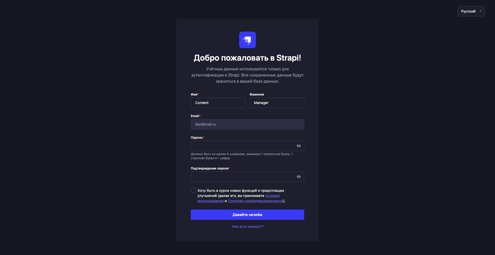
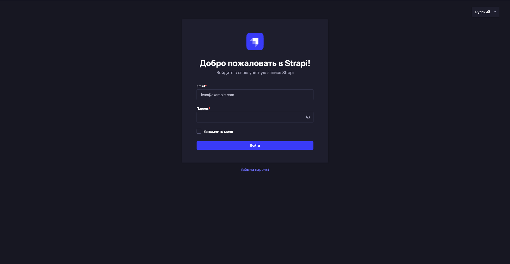
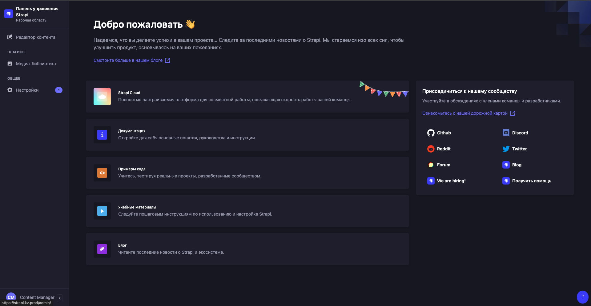
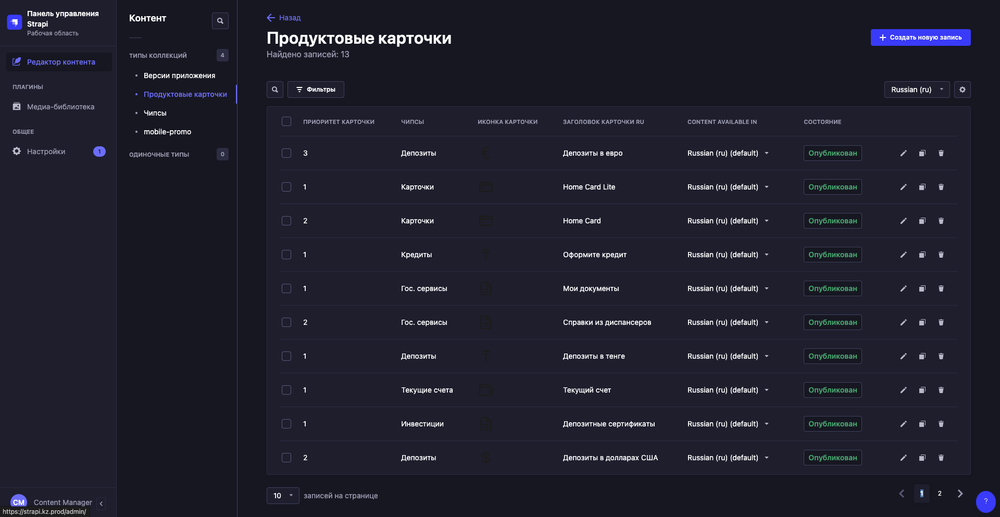
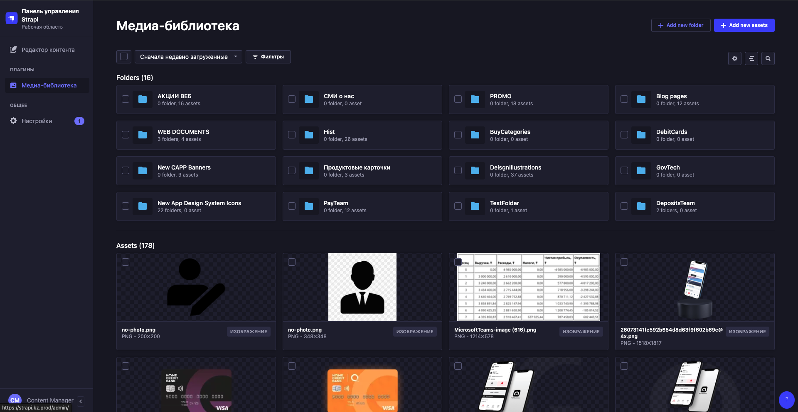
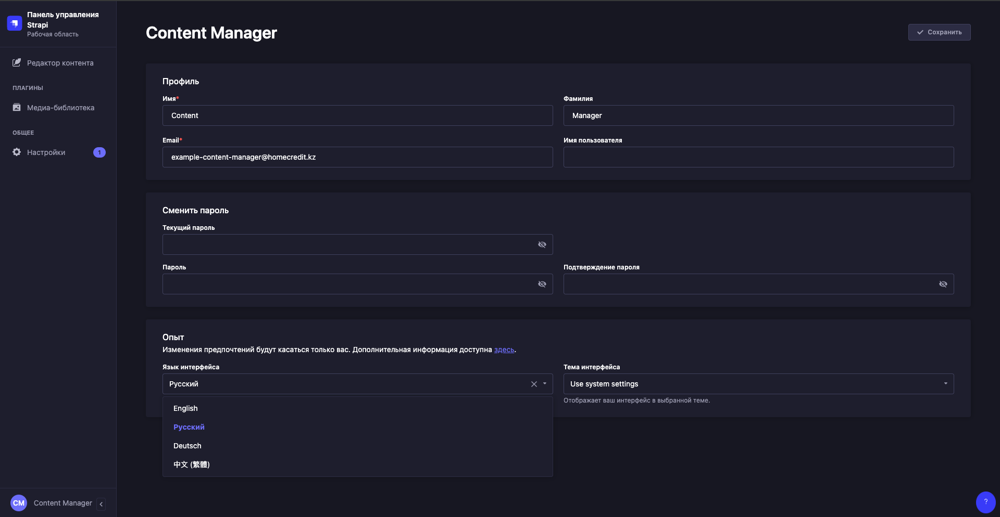

# Инструкция по использованию админкой для контент менеджера strapi

Добро пожаловать в инструкцию по использованию страпи.  
Сделано командой WDV.

## Ссылки на среды
- тест: https://test.strapi.kz.nonprod/admin/
- прод: https://strapi.kz.prod/admin/

## Регистрация

Что бы зарегистрироваться в админ. панели вам необходимо обратиться к вашему руководителю, который создаст заявку ответственным лицам.  
После вам будет выдана ссылка на регистрацию:

После незамысловатой регистрации вы оказываетесь на странице авторизации

## Авторизация

Стандартная страница авторизации

## Админ. панель
Вас встречает админ. панель strapi

 

### Слева находится навигационное меню:

**Редактор контента:**

- Создание / редактирование / удаление / заполнение контента 

 

**Медиа библиотека:**

- Загрузка / удаление медиа (картинки / видео / файлы)

 

**Настройки профиля (слева внизу), с возможностью:**

- Сменить язык админ панели
- Сменить настройки профиля
- Сменить пароль

